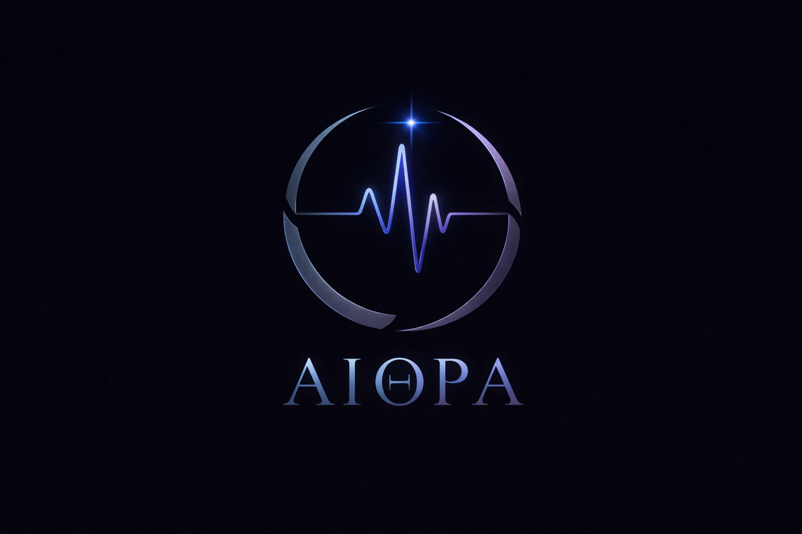

# ÆTHRA VERSION 1.0

  

<h1 align="center">ÆTHRA</h1>

<b></b>

**Official Repo**
# GitHub Website -- https://tanmayczax.github.io/AETHRA/

# Sorry but do not download it today 😔

# Official Website -- https://aethralang.pages.dev/

# Creator's Website
# https://czax.pages.dev/

**A Musical Programming Language for Emotion-Driven Sound**

*ÆTHRA is a new domain-specific programming language (DSL) in version 0.8, designed to compose music using code.
Instead of focusing on low-level audio math, ÆTHRA lets creators express emotion, harmony, and musical structure through readable commands.*

**Till now TESTED ONLY ON WINDOWS**

# ÆTHRA is built for:

Music-driven programmers

Creative coders

Audio experiments

Algorithmic & emotional composition

# What Changed from version 0.8 / What's new?

CROSS PLATFORM

MORE COMMANDS

BETTER EXAMPLES

**STILL FREE AND EASY**

# Philosophy

Music is logic. Emotion is structure. Code is the bridge.

ÆTHRA treats music as a sequence of intentions, not wave equations.
You describe what you want to feel — ÆTHRA handles how it sounds.

# Features (v1.0)

Chord-based composition (no need for raw notes)

Tempo & timing control

Built-in audio effects

Reverb

Echo

Fade In / Fade Out

Scales & harmony awareness

Loops & repetition

Crash-proof interpreter (safe parsing)

Vibrato

Drums

Single-file scripts

WAV audio export

Clean, minimal syntax

# SCREENSHOT 1

# SCREENSHOT 2

**Example: Sad Chord Progression**
@Tempo(60)
@Scale("Minor")
@Reverb(0.7, 0.5)
@Echo(0.5, 0.4)
@Waveform("Triangle")

@FadeIn(4)

@Chord("A3 C4 E4", 4, 0.6)
@Rest(1)
@Chord("F3 A3 C4", 4, 0.6)
@Rest(1)
@Chord("G3 B3 D4", 4, 0.6)
@Rest(1)
@Chord("A3 C4 E4", 6, 0.5)

@FadeOut(5)

# Result: a slow, emotional, cinematic soundscape.

# Language Commands (v0.8)
**Musical Structure**

@Tempo(bpm)	Set tempo

@Scale("Major/Minor")	Set scale

@Chord("notes", duration, volume)	Play a chord

@Rest(seconds)	Silence

**Sound Design**

@Waveform("Triangle/Square/Saw/Noise")	Sound texture

@ADSR(a,d,s,r)	Envelope shaping

@Reverb(amount, decay)	Space

@Echo(delay, feedback)	Depth

**Transitions**

@FadeIn(seconds)	Smooth start

@FadeOut(seconds)	Smooth end

**Control Flow**

@loop(n){ ... }	Repeat block

# Status

Current Version: 0.8

Stability: Mid level powerful

Interpreter: Written in C# (.NET)

Output: WAV audio files

# Roadmap (v1.0)

Instrument profiles

Chord progressions macros

Arpeggiator modes

Visual timeline

Emotion presets

Plugin system

# Contributing

**ÆTHRA is active**
,Ideas and discussions are welcome.

Fork the repo

Create feature branches

# License

MIT License
Free to use

# Name Meaning
(It is a Greek word)
ÆTHRA — derived from Aether, the classical element of the sky.
Symbolizes sound beyond the physical, music as atmosphere, emotion as code. 
